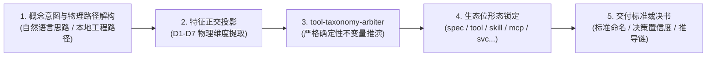

# skill-taxonomy-arbiter (软件架构形态确定性仲裁决策装具)

本 Skill 是 AI 智能体专属的架构决策裁决 SOP。当用户提出类似“我想做一个XXX，应该做成项目还是skill还是mcp？”或“帮我审查一下这个仓库应该归为哪类”时，**严禁使用概率模糊的大语言模型自由发挥推演，必须严格执行本 SOP 调用确定性底层装具给出数学裁决**。

---

## 🧭 五步标准作业程序 (Standard Operating Procedure)



### 步骤 1：意图与物理载体解构 (Input Parsing)
* 判断用户输入类型：
  * **类型 A：全新思路/需求构想**（如“我想做一个自动从网页抓取数据并推送到飞书的通知器”）；
  * **类型 B：现有本地代码仓库**（如提供路径 `D:\github\my-project` 或多仓总览）。

### 步骤 2：调动底层确定性装具 (Execution)
* **对于新思路构想**：
  直接调用装具命令执行推演：
  ```bash
  python D:/github/tool-taxonomy-arbiter/main.py run --idea "<用户需求完整描述>"
  ```
* **对于现有代码仓库**：
  调用装具代码审计模式：
  ```bash
  python D:/github/tool-taxonomy-arbiter/main.py run --path "<本地工程绝对路径>"
  ```
* **对于多仓目录或目录索引文档**：
  ```bash
  python D:/github/tool-taxonomy-arbiter/main.py run --path "D:/github/FLEET_TAXONOMY_CATALOG.md"
  ```

### 步骤 3：七维正交特征解析 (7-D Feature Space)
智能体必须结合以下七维指标向用户展示客观依据：
1. **D1. Lifecycle (生命周期)**：0.0 = 瞬时极速退出 CLI，1.0 = 后台常驻守护进程/事件循环。
2. **D2. Protocol (通信边界)**：0.0 = Stdio/CLI 参数，0.5 = MCP JSON-RPC，1.0 = 网络端口 (HTTP/WS/gRPC)。
3. **D3. Execution (执行载体)**：0.0 = 纯文本/规范/提示词，1.0 = 机器指令/编译解释型代码。
4. **D4. Agenticity (智能体化)**：0.0 = 确定性机械算法，1.0 = LLM 提示词认知操作流程。
5. **D5. Boundary (边界性质)**：0.0 = 业务功能，0.9 = 规范标准 Spec，1.0 = 负向红线防御 Rule。
6. **D6. Swarm (集群协同)**：0.0 = 单节点工具，1.0 = 多智能体协作网格/集群大脑。
7. **D7. Interface (交互终端)**：0.0 = Headless API/无界面，1.0 = GUI/移动APK/桌面端。

### 步骤 4：对齐 11 大标准架构生态位
根据数学裁决结果，锁定唯一法定形态与标准前缀：
* `spec-*`：刚性规范标准、契约与验收神谕（无运行期业务代码）
* `rule-*`：负向行为红线、安全拦截规则、静态守卫
* `tool-*`：无状态原子微装具、极速命令行工具（符合 UCFS 五动词）
* `skill-*`：智能体 SOP 认知流程、提示词工作流、多工具组装指南
* `mcp-*`：Model Context Protocol 标准协议服务器
* `svc-*`：网络长驻微服务、HTTP/WebSocket 端口网关
* `cluster-*`：多智能体网格协同、AI 集群自治中枢
* `app-*`：终端用户应用、桌面端 GUI、安卓 APK、端到端业务机器人
* `infra-*`：网络穿透、Tailscale DERP 中继、服务器基础设施
* `cfg-*`：开源平台运行配置、docker-compose、工作区模版
* `doc-*`：知识库白皮书、战术手册、排障笔记

### 步骤 5：标准化交付裁决书 (Output Delivery)
向用户输出结构化报告，包括：
1. **裁决形态** 与 **标准命名**（带法定前缀）
2. **决策置信度**（数学相似度）
3. **七维空间投影坐标图**
4. **形式化数学推导逻辑链**
5. **必须遵循的核心刚性不变量**
