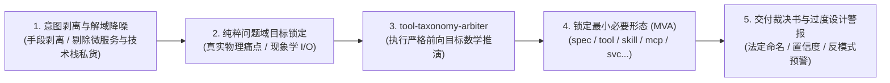

# skill-taxonomy-arbiter (软件架构形态确定性仲裁决策特种技能)

本 Skill 是 AI 智能体专属的架构决策裁决 SOP。当用户提出类似“我想做一个XXX，应该做成项目还是skill还是mcp？”或“帮我审查一下这个仓库应该归为哪类”时，**严禁使用概率模糊的大语言模型自由发挥推演，坚决禁止逆向看现有代码先描再画，必须严格从【原始核心目标与痛点】出发调用确定性底层装具给出最小必要形态（MVA）数学裁决**。

---

## 🧭 五步标准作业程序 (Standard Operating Procedure)



### 步骤 1：解域私货剥离与意图清洗 (Intent De-noising Scalpel)
* **识别解域技术栈绑定与私货 (Solution Domain Bias)**：
  * 成熟项目或口语提示词中常混杂实现手段，例如：“基于 FastAPI 和 Redis 的图片哈希微服务”、“用 Docker 部署的爬虫后台”。
  * 这些技术名词（FastAPI/Redis/Docker/微服务/常驻后台/监听端口）属于**手段层（Solution Domain）**，绝不能作为判定形态的基石！
* **提取纯粹问题域目标 (Pure Problem Domain Goal)**：
  * 剥离技术手段后，追问本质：“它在现实世界中究竟将什么输入转换为输出？”（如：“计算图片感知哈希”）。
  * 核心缺口是“AI 不懂多轮操作思考步骤”（-> skill），还是“需要单次执行的机器算法”（-> tool），还是“必须长驻端口承载不可预测外部请求”（-> svc）？

### 步骤 2：调动底层前向确定性装具 (Execution)
* **对于新思路构想（哪怕掺杂了技术私货）**：
  直接调用装具命令执行前向推演：
  ```bash
  python D:/github/tool-taxonomy-arbiter/main.py run --idea "<用户原始核心目标陈述>"
  ```
* **对于现有代码仓库**：
  调用装具使命解析模式（自动提取 README 核心初衷而非扫描文件）：
  ```bash
  python D:/github/tool-taxonomy-arbiter/main.py run --path "<本地工程绝对路径>"
  ```
* **对于多仓目录或目录索引文档**：
  ```bash
  python D:/github/tool-taxonomy-arbiter/main.py run --path "D:/github/FLEET_TAXONOMY_CATALOG.md"
  ```

### 步骤 3：十一类形态本质与不可动摇判定基石 (The 11 Archetypes Foundations)
智能体必须向用户展示清晰的前向推演基石：
1. **`spec-*` (刚性规范标准)**：零机器执行代码。数据结构 Schema、通信协议规范、验收神谕 (Acceptance Oracle)。
2. **`rule-*` (负向行为红线)**：零独立实体。纯负向拦截条件、违规门禁守卫，自身不提供业务运算。
3. **`skill-*` (智能体认知 SOP)**：零独立二进制。纯大模型思维提示词指导 + 工具装配 SOP。核心主体在“教大模型思考”，底层算力依赖已有工具。
4. **`doc-*` (战术手册与知识库)**：零机器运行实体。面向人类大脑心智同步的经验传承、调研报告、白皮书。
5. **`cfg-*` (工作区环境配置)**：零业务算法代码。第三方成熟开源平台 (Dify/n8n/Docker-Compose) 声明式预设。
6. **`tool-*` (确定性原子微装具)**：机器算法逻辑，但**生命周期极其短暂（秒级/分钟级执行完毕即退出进程）**。无常驻端口，输入->纯运算->输出->退出码0。
7. **`mcp-*` (Model Context Protocol 专用服务)**：严格实现 Anthropic MCP 协议标准，专为 LLM 宿主（Cursor/Claude）暴露受控工具与上下文数据总线。
8. **`svc-*` (网络长驻守护服务)**：**生命周期持续运行，必须绑定 TCP/UDP 端口，监听并处理不可预测的外部网络异步并发请求**。本地计算绝不可做成 svc！
9. **`cluster-*` (集群自治中枢)**：单进程物理不可闭环，必须依赖多节点分布式共识、多智能体博弈或网格调度协同。
10. **`app-*` (终端人机交互应用)**：直接面向人类用户的交互界面（GUI/桌面/移动端 APK/Web 前端 SPA），或特定垂直业务全自动闭环机器人。
11. **`infra-*` (基础设施中继)**：物理层网络穿透、中继转发与边缘宿主环境（DERP、Tailscale、VPS 代理分流）。

### 步骤 4：反模式过度设计抓包与预警 (Anti-Pattern Over-engineering Alert)
* 若用户或原作者宣称使用了 `svc-*`（如微服务/常驻后台/监听端口），但纯粹问题域仅为离线数据处理、文件分析、哈希运算或规则质检：
  * **必须坚决裁定为 `tool-*`**！
  * **发出过度设计警报**：指出其引入了非必要的常驻内存消耗、端口安全暴露面与维护复杂度，属于“高射炮打蚊子”。
* 若输入内容全系从目录复制的模板套话（如“包含长驻留后台进程、HTTP/WebSocket端口监听”）：
  * **发出纯套话模板警报**：指出缺乏真实业务问题域定义，判定置信度受限。

### 步骤 5：标准化交付裁决书 (Output Delivery)
向用户输出结构化报告：
1. **原始输入陈述** 与 **清洗后的纯粹问题域目标**
2. **识别出的解域私货**（技术栈与架构声明）
3. **确定性裁定形态** 与 **推荐法定命名**（带标准前缀）
4. **裁决置信度**
5. **最小必要形态理由（MVA Rationale）**
6. **过度设计反模式预警（Over-engineering Alert）**
7. **形式化推演逻辑链条**
