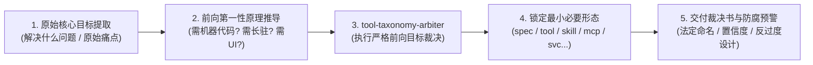

# skill-taxonomy-arbiter (软件架构形态确定性仲裁决策特种技能)

本 Skill 是 AI 智能体专属的架构决策裁决 SOP。当用户提出类似“我想做一个XXX，应该做成项目还是skill还是mcp？”或“帮我审查一下这个仓库应该归为哪类”时，**严禁使用概率模糊的大语言模型自由发挥推演，坚决禁止逆向看现有代码先描再画，必须严格从【原始核心目标与痛点】出发调用确定性底层装具给出最小必要形态（MVA）数学裁决**。

---

## 🧭 五步标准作业程序 (Standard Operating Procedure)



### 步骤 1：原始核心意图解构 (Intent Decomposition)
* 提取用户或项目的最根本诉求：
  * **它要解决的核心问题是什么？**
  * **核心缺口是“AI不知道步骤”，还是“机器需要确定性计算算法”？**
* 严禁根据“代码里已经有什么文件”倒推；如果现有项目代码庞大但目标只需要一个脚本，必须按目标判定为 `tool-*` 并指出过度设计！

### 步骤 2：调动底层前向确定性装具 (Execution)
* **对于新思路构想**：
  直接调用装具命令执行前向推演：
  ```bash
  python D:/github/tool-taxonomy-arbiter/main.py run --idea "<用户原始核心目标陈述>"
  ```
* **对于现有代码仓库**：
  调用装具使命解析模式（自动提取 README 核心初衷而非扫描文件）：
  ```bash
  python D:/github/tool-taxonomy-arbiter/main.py run --path "<本地工程绝对路径>"
  ```
* **对于多仓目录或目录索引文档**：
  ```bash
  python D:/github/tool-taxonomy-arbiter/main.py run --path "D:/github/FLEET_TAXONOMY_CATALOG.md"
  ```

### 步骤 3：五级第一性原理推演验证 (5-Stage Forward Deduction)
智能体必须向用户展示清晰的前向推演链条：
1. **关卡 1：需要写可执行机器代码吗？**
   * 建立正向接口规范/验收准则 ──➔ `spec-*`
   * 设立绝对负向安全红线/禁令 ──➔ `rule-*`
   * 教 AI 怎么逐步思考并调用现有工具 ──➔ `skill-*`（严禁过度设计为项目）
   * 沉淀给人脑学习的战术白皮书 ──➔ `doc-*`
2. **关卡 2：需要 7x24 小时长驻后台监听吗？**
   * 不需要！算完就退出 (秒级极速命令行) ──➔ `tool-*`
3. **关卡 3：长驻是为了给谁提供服务？**
   * 专为大模型宿主暴露专有工具与数据上下文 ──➔ `mcp-*`
   * 对外提供通用的 HTTP/WebSocket 并发网关 ──➔ `svc-*`
   * 单个程序搞不定，需要多智能体协同网格 ──➔ `cluster-*`
   * 包含终端人机交互界面 (GUI/APK/Web) 或垂直业务机器人 ──➔ `app-*`
   * 底层网络穿透、Tailscale DERP、VPS 中继基建 ──➔ `infra-*`
   * 第三方开源平台运行时配置与模板 ──➔ `cfg-*`

### 步骤 4：标准化交付裁决书 (Output Delivery)
向用户输出结构化报告：
1. **原始核心目标陈述**
2. **确定性裁定形态** 与 **推荐法定命名**（带标准前缀）
3. **裁决置信度**
4. **最小必要形态理由（MVA Rationale）**
5. **反模式过度设计预警（Anti-Pattern Warning）**
6. **形式化推演逻辑链条**
